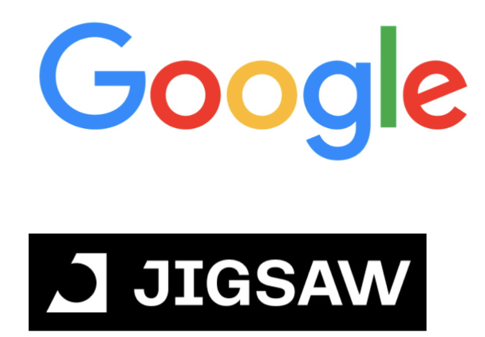

## Overview

The 8th Workshop on Online Abuse and Harms (WOAH) is taking place on **June 20 2024**, as part of [NAACL 2024](https://2024.naacl.org/) in Mexico City.

The special theme for this year is **Online Harms in the Age of Large Language Models**.

Join us in person **from 9am in Room Alberto 3 at Hilton Reforma Mexico City** or watch online via [this link](https://us06web.zoom.us/j/83509919075?pwd=7BxGYaSd2sbE5kIwanEWIS54Imrvcd.1).

  

## Schedule
09:00 - 09:15: Opening Remarks

09:15 - 09:45: Invited Talk 1: Alicia Parrish (Google)

09:45 - 10:15: Invited Talk 2: Lama Ahmad (OpenAI)

10:15 - 10:30: Mini Break

10:30 - 11:00: Invited Talk 3: Apostol Vassilev (NIST)

11:00 - 12:30: Poster Session (see details [here](https://www.workshopononlineabuse.com/programme.html))

12:30 - 13:45: Lunch

13:45 - 14:15: Invited Talk 4: Seraphina Goldfarb-Tarrant (Cohere)

14:15 - 14:30: Outstanding Paper

14:45 - 15:30: Lightning Talks by remote presenters (see detailed talks [here](https://www.workshopononlineabuse.com/programme.html))

15:30 - 16:00: Invited Talk 5: Yacine Jernite (Hugging Face)

16:00 - 16:45: Break

16:45 - 17:45: Panel Discussion - *Online Harms in the Age of Large Language Models*

17:45 - 17:55: Closing Remarks
  

## Invited Speakers
- <a href="https://aliciaparrish.com/">Alicia Parrish</a> is a research scientist working on responsible AI team at Google Deepmind in NYC. Her work focuses on better understanding adversarial data for large AI models and studying how to best ensure high data quality for both model training and evaluation. Some of Alicia’s work also addresses different aspects of data collection protocols, looking at the task set up, how the labels are aggregated, and annotator characteristics. Alicia holds a PhD in linguistics from New York University.
- <a href="https://www.linkedin.com/in/lamaahmad/">Lama Ahmad</a> is a Technical Program Manager in OpenAI’s Policy Research team, working in the areas of technology research, product, and policy. As a part of the Policy Research team at OpenAI, Lama works on the safe development and deployment of AI models, and she leads the Researcher Access Program to enable the study of key areas related to the responsible deployment of AI and mitigating risks associated with such systems.
- <a href="https://www.linkedin.com/in/avassilev/">Apostol Vassilev</a> is a research team supervisor in the Computer Security Division at NIST. His team’s research agenda covers a range of topics in Trustworthy and Responsible AI and Cybersecurity, with a focus on Adversarial Machine Learning (AML), Robust AI for Autonomous Vehicles, AI bias, meta learning with large language models (LLMs). Vassilev works closely with academia, industry and government agencies on the development and adoption of standards in artificial intelligence and cybersecurity and contributes to national and international standards groups. Vassilev holds a Ph.D. in mathematics from Texas A&M University. He has authored over 50 scientific papers and holds five U.S. patents. His work has been profiled in the Wall Street Journal, Politico, VentureBeat, Fortune, Forbes, the Register, InfoSecurity, StateScoop, FedScoop, NIST Taking Measure Blog, podcasts, webinars, and others.
- <a href="https://seraphinatarrant.github.io/">Seraphina Goldfarb-Tarrant</a> is the Head of Safety at Cohere, where she works on both the practice and the theory of evaluating and mitigating harms from LLMs. She did her PhD under Adam Lopez in Fairness in Transfer Learning for NLP, at the Institute for Language, Cognition, and Computation (ILCC) in the Informatics department at the University of Edinburgh. She did her MSc in NLP, with a focus on Natural Language Generation, at the University of Washington under Fei Xia in collaboration with Nanyun Peng. Her research interests include the intersection of fairness with robustness and generalisation, cross-lingual transfer, and causal analysis. She had an industry career before her PhD, where she worked at Google in Tokyo, NYC, and Shanghai. She also spent two years as a sailor in the North Sea.
- <a href="https://yjernite.github.io/">Yacine Jernite</a> leads the ML and Society team at Hugging Face, where he works on ML systems governance at the intersection of regulatory and technical tools. Yacine’s work to date has focused on NLP models and data curation, documentation, and governance, most recently as co-organizer and data area chair for the BigScience workshop on large language models. Yacine completed his PhD at New York University in January 2018 under the supervision of Prof. David Sontag.

  

## Organisers

- 
<a href="https://paulrottger.com/">Paul Röttger</a>, Bocconi University

- 
<a href="https://yilingchung.github.io/">Yi-Ling Chung</a>, The Alan Turing Institute

- 
<a href="https://deboranozza.com/">Debora Nozza</a>, Bocconi University

- 
<a href="https://aidamd.github.io/">Aida Davani</a>, Google Research

- 
<a href="https://ago3.github.io/">Agostina Calabrese</a>, University of Edinburgh

- 
<a href="https://fmplaza.github.io/">Flor Miriam Plaza-del-Arco</a>, Bocconi University

- 
<a href="https://zeeraktalat.github.io/">Zeerak Talat</a>, MBZUAI

  

## Sponsors

WOAH appreciates the support from the following sponsors:

**Diamond Tier**

**Gold Tier**

  

## Contact
If you have any questions, please get in touch at <a href="mailto:organizers@workshopononlineabuse.com">organizers@workshopononlineabuse.com</a>
