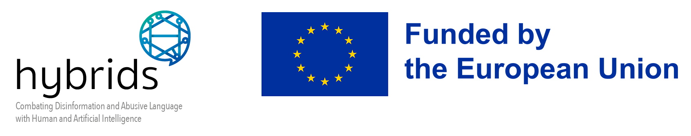

## Overview

The 10th Workshop on Online Abuse and Harms (WOAH) is taking place on **24-29 October 2026**, as part of [EMNLP 2026](https://2026.emnlp.org/) in Budapest.

<!--The workshop will take place in **TBD**.-->

Digital technologies have brought significant benefits to society, transforming how people connect, communicate, and interact. However, these same technologies have also enabled the widespread dissemination and amplification of abusive and harmful content, such as hate speech, harassment, and misinformation. Given the sheer volume of content shared online, addressing abuse and harm at scale requires the use of computational tools. Yet, detecting and moderating online abuse remains a complex task, fraught with technical, social, legal, and ethical challenges.

The 10th Workshop on Online Abuse and Harms (WOAH) invites paper submissions from a diverse range of fields, including but not limited to natural language processing, machine learning, computational social science, law, political science, psychology, sociology, and cultural studies. We explicitly encourage interdisciplinary research, technical and non-technical contributions, and submissions that focus on under-resourced languages. Non-archival papers and civil society reports are also welcome.

Topics covered by WOAH include, but are not limited to:

- New models or methods for detecting abusive and harmful online content, including misinformation;
- Biases and limitations in existing detection models or datasets for abusive and harmful content, especially those in commercial use;
- Development of new datasets and taxonomies for online abuse and harms;
- Novel evaluation metrics and procedures for detecting harmful content;
- Analyses of the dynamics of online abuse, its propagation, and its impact on different communities;
- Social, legal, and ethical considerations in detecting, monitoring, and moderating online abuse.

In addition, we invite submissions related to the theme for this tenth edition of WOAH, which will be **Ten Years of WOAH: Reflecting on Progress and New Frontiers**. We aim to reflect on a decade of research on online harms by examining how these phenomena—and the technologies that shape them—have evolved over time. While early work focused primarily on textual hate speech and harassment, the landscape has expanded to include a broader range of harms such as radicalisation, child sexual exploitation, gender-based abuse, misinformation, and algorithmic bias. At the same time, advances in AI, multimodal platforms, and large-scale recommendation systems have transformed how harmful content is produced, amplified, and experienced online. These shifts raise new questions about how harms should be defined, measured, and addressed across languages, cultures, and modalities. To support this reflection, we invite NLP researchers, social scientists, legal and policy scholars, and practitioners to engage with key challenges emerging after ten years of WOAH. These include the conceptualisation and measurement of harm, the limitations of current datasets and models, the role of platforms and algorithms in shaping online environments, and the need for more inclusive, multilingual, and interdisciplinary approaches. By fostering dialogue across disciplines, our goal is to assess progress made over the past decade, identify persistent gaps, and help set priorities for the next generation of research on online harms.

 

## Organisers

<ul class="organisers-grid">
  <li class="organiser-card">
    
    

      <a href="https://ago3.github.io/" target="_blank" rel="noopener noreferrer">Agostina Calabrese</a>
      University of Edinburgh
    

  </li>
  <li class="organiser-card">
    
    

      <a href="https://thomasrdavidson.com/" target="_blank" rel="noopener noreferrer">Thomas Davidson</a>
      Rutgers University
    

  </li>
  <li class="organiser-card">
    
    

      <a href="https://christinedekock.com/" target="_blank" rel="noopener noreferrer">Christine De Kock</a>
      University of Melbourne
    

  </li>
  <li class="organiser-card">
    
    

      <a href="https://urjakh.github.io/" target="_blank" rel="noopener noreferrer">Urja Khurana</a>
      Delft University
    

  </li>
  <li class="organiser-card">
    
    

      <a href="https://martamarchiori.github.io/" target="_blank" rel="noopener noreferrer">Marta Marchiori Manerba</a>
      University of Turin
    

  </li>
  <li class="organiser-card">
    
    

      <a href="https://palomapiot.github.io/" target="_blank" rel="noopener noreferrer">Paloma Piot</a>
      Universidade da Coruña
    

  </li>
  <li class="organiser-card">
    
    

      <a href="https://zeeraktalat.github.io/" target="_blank" rel="noopener noreferrer">Zeerak Talat</a>
      University of Edinburgh
    

  </li>
</ul>

 

## Sponsors

We are looking for sponsors! If you are interested, please contact us as <a href="mailto:organizers@workshopononlineabuse.com">organizers@workshopononlineabuse.com</a>

<!--**Platinum Tier**-->

**Gold**

  

## Contact
If you have any questions, please get in touch at <a href="mailto:organizers@workshopononlineabuse.com">organizers@workshopononlineabuse.com</a>
